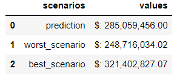

# Previsão de Vendas: Rossmann.

## Descrição: 

Esse projeto é baseado num desafio do Kaggle cujo contexto é prever as vendas das próximas seis semanas para uma rede de farmácias (Rossmann) que atua em 7 países europeus com mais de 3000 lojas. Para isso, utilizei o modelo de regressão linear, seguindo a metodologia CRISP-DS para rápida entrega de resultado.

## 1.0. Contexto:

A Rossmann opera mais de 3000 farmácias em 7 cidades da Europa. Seu CFO pediu para que cada um dos gerentes das lojas previssem a receita para as próximas 6 semanas. As vendas são influenciadas por muitos fatores como promoções, competidores, feriados, sazonalidade e localidade. Porém, com milhares de gerentes prevendo as vendas baseados nas circunstâncias de suas lojas, e sem a utilização de nenhum método científico, a acurácia da previsão pode ser muito variada. Por isso, uma solução utilizando Ciência de Dados vai tornar os resultados mais precisos e uniformes.

## 2.0. Desafio:

### 2.1. Problema:

O passo mais importante de um projeto de dados é descobrir se a demanda que foi feita realmente soluciona o problema por trás dela. Então é essencial buscar por respostas para perguntas do tipo: qual é a finalidade dessa previsão? por que é esperado que ela solucione o problema?

Suponhamos então, que o CFO queira essas previsões para definir o quanto poderá investir na reforma de cada loja.

### 2.2. Causas:

Agora, tendo a causa raiz da demanda em mente - as reformas - é boa prática procurar saber um pouco mais sobre o motivo pelo qual as previsões atuais não dão conta do problema. Nesse caso, obtivemos as seguintes conclusões:

- Previsões não consistentes, feitas manualmente pelos gerentes de cada loja;
- Visualização das predições limitadas a planilhas num computador local.

### 2.3. Solução:

Com o motivo real por trás da demanda em mente, e as causas pela qual as soluções já existentes não atendem esse problema, agora se torna muito mais fácil planejar o que pode ser feito, e se um modelo de Machine Learning é realmente necessário. Afinal, os Cientistas de Dados trabalham para **resolver problemas reais de negócio**, e se isso puder ser feito de maneira simples e rápida, sem a aplicação de um modelo, então deve ser feito.

Voltando a narração do projeto: Machine Learning é uma ótima opção para esse caso. Então nosso objetivo será entregar:

- Modelo de Machine Learning que faça a previsão das vendas para as próximas 6 semanas;
- Bot no telegram que permita com que os colaboradores vejam essa previsão de qualquer smartphone ou computador conectado a internet.

## 3.0. Desenvolvimento da solução:

### 3.1. Descrição dos Dados: 
Checagem do dataset por inteiro, como sua dimensão, NA's, tipos de variáveis... Por final, uma descrição estatística.
### 3.2. Feature Engineering: 
Etapa pré análise exploratória. Criação das hipóteses com finalidade de criar as features necessárias para a análise.
### 3.3. Análise Exploratória:
Exploração dos dados com foco no entendimento das métricas do negócio, geração de insights e correlação de variáveis.
### 3.4. Preparação dos Dados: 
Normalização, rescaling e transformação dos dados para os modelos de Machine Learning.
### 3.5. Seleção de Variáveis: 
Utilização do algoritmo Boruta, em conjunto com o conhecimento obtido na análise exploratória, para selecionar as variáveis/features mais importantes para os modelos.
### 3.6. Modelos de Machine Learning:
Aplicação dos modelos de Machine Learning com Cross-Validation para definir o que apresenta melhor resultado.
### 3.7. Tradução dos erros: 
Conversão dos erros do modelo escolhido para resultados financeiros de negócio.
### 3.8. Deploy:
Deploy do script na nuvem Heroku para tornar o modelo acessível em outras máquinas e construção do bot no telegram.

## 4.0. Os 3 principais insights dos dados:

Dentro de 11 hipóteses validadas e desvalidadas, essas são as que mais geraram surpresa:

- H1: Lojas com maior sortimento deveriam vender mais.

**FALSA**. Lojas com maior sortimento vendem menos.

- H2: Lojas com competidores mais próximos deveriam vender menos.

**FALSA**. Lojas com competidores mais próximos vendem mais.

- H3: Lojas com competidores à mais tempo deveriam vender mais.

**FALSA**. Lojas com competidores recentes tem um pico de vendas, e com o tempo as vendas abaixam e se tornam mais constantes.

## 5.0. Resultados de negócio e conclusão:

Com a solução elaborada no projeto, a rede Rossmann tem como esperada a receita de aproximadamente $ 285,059,456.00 nas próximas seis semanas, com seus respectivos pior/melhor cenários devido a erros do algoritmo calculados abaixo.

A previsão individual de cada loja pode ser consultada pelo Telegram, conforme a [demonstração](https://youtube.com/shorts/iXpcF_Y6k0g?feature=share). Com isso, resolvemos nossa questão de negócio, visto que o CFO pode, a qualquer momento, consultar a receita que está por vir para cacular o budget da reforma para cada uma das lojas.

## 6.0. Próximos passos:

- Coletar feedbacks sobre a usabilidade do produto de dados com os colaboradores;
- Fazer outro ciclo CRISP-DS para diminuir os erros do modelo.

## 7.0. Referências:

- O dataset utilizado se encontra no [Kaggle](https://www.kaggle.com/c/rossmann-store-sales/data)
